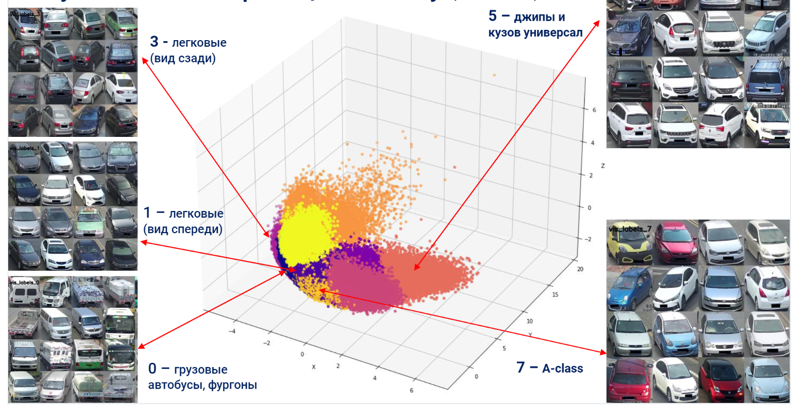

# Intelly Vision Project

## Немного о компании: 

IntelliVision разрабатывает ПО для обработки изображений и анализа видео. Компания проектирует и обучает нейронные сети, работает с потоковым распознаванием видео и звука.

Программное обеспечение от IntelliVision установлено на 5 млн камер в умных домах, промышленных помещениях и торговых центрах по всему миру, а их системы помощи водителю ADAS каждый день используют более 1.5 млн автовладельцев.

С 2018 компания является частью корпорации Nortek Security & Control, её главный офис находится в Сан-Хосе, штат Калифорния, США. Один из крупнейших центров разработки компании расположен в России — в Нижнем Новгороде.

## Примечание:

Поскольку данные занимают большой объем (30 ГБ !) их следует скачать отдельно:

[Intelly Vision Project](https://disk.yandex.ru/d/1Fv9szZpZHghMA)

## Информация о данных:

Исходная папка с данными имеет следующую структуру:

    Intellivision_case
    ├─descriptors
        └─efficientnet-b7.pickle
        └─osnet.pickle
        └─vdc_color.pickle
        └─vdc_type.pickle
    ├─raw_data
    └─veriwild.zip
    ├─images_paths.csv

## Описание содержимого:

* В папке descriptors — дескрипторы (векторные признаки), полученные для каждого изображения с помощью различных нейронных сетей, сохранённые в формате .pickle;

* efficientnet-b7.pickle — признаки, выделенные моделью EfficientNet-B7 (предобученной на ImageNet, не обучалась на veriwild);

* osnet.pickle — признаки, выделенные моделью OSNet (детектирование людей, животных, машин);

* vdc_color.pickle — признаки модели регрессии по цвету ТС (частично обучена на veriwild);

* vdc_type.pickle — признаки модели классификации типа ТС (10 классов, частично обучена на veriwild).

## Особенность проекта: сохранение промежуточных результатов

Так как объём данных __очень большой__ (~30 ГБ, >400 тыс. изображений), полный прогон всех шагов может занимать значительное время.

Чтобы обеспечить удобную и модульную работу с проектом, на каждом этапе обработки данных промежуточные результаты автоматически сохраняются в соответствующие папки:

| Этап обработки | Папка | Описание содержимого |
|----------------|-------|---------------------|
| Исходные данные (инициализация) | `Data/Init` | DataFrame с cоединяем пути images и дескрипторы |
| Масштабирование признаков | `Data/Scaled` | Добавленные колонки после масштабирования (StandardScaler, MinMaxScaler, RobustScaler) |
| Масштабирование + PCA | `Data/Scaled_PCA` | Дескрипторы после PCA (сниженная размерность) |
| Масштабирование + PCA + Кластеризация | `Data/Scaled_PCA_Cluster` | После оценок кластеризации оставляем определенные скейлеры удалив не нужные|
| Кластеризация без PCA (по желанию) | `Data/Clustered` | Метки кластеров на исходных/масштабированных дескрипторах в данных количество меток ограничено (по-умолчанию 15 000 записей)|
| Финальные таблицы для отчёта / передачи | `Data/Final` | CSV с `image_path` + метка кластера полный набор (`cluster`) |

## Информация о проекте

Один из ключевых проектов IntelliVision — Smart City / Transportation — система для обеспечения безопасности дорожного движения и оптимизации парковок.

С помощью системы можно:

* контролировать сигналы светофоров и соблюдение ограничений скорости;

* определять типы ТС;

* распознавать номерные знаки;

* считать автомобили и людей.

В основе всех возможностей — технологии компьютерного зрения (CV), работающие в реальном времени. Система постоянно обрабатывает всё больше данных, требуя модернизации алгоритмов.

В проекте необходимо автоматизировать определение дополнительных параметров автомобиля:

* тип кузова;

* ракурс (вид спереди/сзади);

* цвет автомобиля;

* автоматический поиск выбросов (засветы, блики, пустые изображения и т.п.).

Объём данных — 416 314 изображений ТС различных типов, цветов и с разных ракурсов:

Команда уже подготовила дескрипторы для каждого изображения.

## Задачи проекта
Используя готовые дескрипторы, необходимо:

1. __Разбить изображения на кластеры__ и интерпретировать их содержимое.

2. Применить несколько алгоритмов кластеризации, сравнить их результаты.

3. Найти выбросы среди изображений.

4. Дополнительно (не реализовано) — протестировать кластеризацию с комбинированными дескрипторами.

## Бизнес-задача
Проверить возможность применения алгоритмов кластеризации для автоматической разметки новых данных и поиска выбросов.

## Техническая задача

Построить __модель кластеризации изображений__ на основе различных дескрипторов нейронных сетей. Проанализировать результаты и выбрать наилучшие решения.

## Основные цели
1. Для каждого типа дескрипторов:

* выполнить предобработку;

* провести кластеризацию с подбором алгоритма и параметров;

* визуализировать кластеры (2D/3D);

* интерпретировать кластеры.

2. Сравнить полученные кластеризации.

3. Выполнить автоматизированный поиск выбросов.

4. Дополнительно (не реализовано): провести кластеризацию __на комбинированных дескрипторах__ (например, EfficientNet + OSNet), чтобы учитывать как глобальные, так и локальные признаки изображения.

* Базовый подход: __конкатенация признаков__ с последующей понижением размерности (например, PCA или UMAP).

## Данный проект состоит:

0. Загрузка, создание и сохранение датасетов 

1. Знакомство со структурой данных

2. Преобразование, очистка и анализ данных

3. Моделирование и оценка качества модели

4. Выводы и оформление проекта

## Проект оформлен согласно требованиям:

* Решение в Jupyter Notebook.

* Чёткие выводы по ключевым вопросам.

* Соответствие PEP 8.

* Промежуточные выводы после каждой задачи.

* Использование numpy, pandas, seaborn, scipy, statsmodels и других доступных библиотек.

Финальный прогноз сохранён 4 дескрипторов в csv.